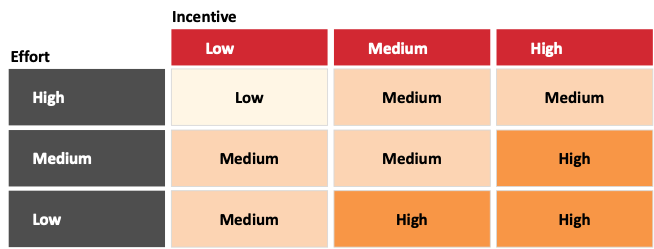
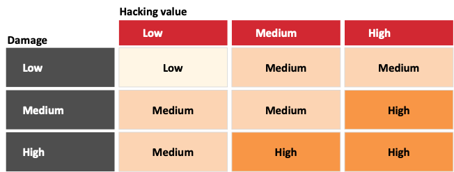

# Deliverables

## Overview

| Document        | Description   |
| --------------- | ------------- |
| TBD             | TBD           |

## Threat Model

Blockchain systems continue to gain traction in spite of hacking attacks threatening the scalability, sustainability, and security of the technology. This review focuses on the various security concerns in Joystream’s implementation. These have been classified in a threat model, using the CIA security triad model, in the following three areas: (1) Confidentiality, (2) Integrity and (3) Availability.

#### Framework

The goal of the threat model framework is to be able to determine specific areas of risk in Joystream’s blockchain system. Familiarity with these risk areas can provide guidance for the design of the implementation stack, the actual implementation of the stack, as well as, the security testing. This section introduces how risk is defined and provides an overview of the identified threat scenarios.
The ‘Hacking Value’, categorized into low, medium, and high, takes into account the *incentive* of an attacker, as well as, the effort required by an attacker to successfully execute the attack. The hacking value is calculated as: 

While 'incentive’ describes what an attacker might gain from preforming an attack successfully, ‘effort’ estimates the complexity of this same attack. The degrees of incentive and effort are defined as follows:

**Incentive**:
* **Low:** Attacks offer the hacker little to no gain from executing the threat. 
* **Medium:** Attacks offer the hacker considerable gains from executing the threat. 
* **High:** Attacks offer the hacker high gains by executing this threat.

**Effort:**
* **Low:** Attacks are easy to execute. They require neither elaborate technical knowledge nor considerable amounts of resources.
* **Medium:** Attacks are somewhat difficult to execute. They might require bypassing countermeasures, the use of expensive resources or a decent amount of technical knowledge.
* **High:** Attacks are difficult to execute. The attacks might require in-depth technical knowledge, vast amounts of expensive resources, bypassing countermeasures or any combination of these factors.

*Incentive* and *Effort* are divided according to Figure 1.

*Figure 1. Hacking value measurement scale.*

Hacking scenarios are classified by the risk they pose to the system. The risk level, also categorized into low, medium, and high, takes into account the hacking value, as well as, the damage that could result from a successful exploitation.
The risk of a threat scenario is calculated by the following formula:

Damage describes the negative impact that a given attack, performed successfully, would have on the victim. The degrees of damage are defined as follows:

**Damage:**
* **Low:** Risk scenarios would cause negligible damage to the Joystream Network
* **Medium:** Risk scenarios pose a considerable threat to Joystream’s functionality as a network.
* **High:** Risk scenarios pose an existential threat to Joystream’s network functionality.

*Damage* and *Hacking Value* are divided according to Figure 2.

*Figure 2. Risk measurement scale*

#### Confidentiality

Confidentiality threat scenarios concern sensitive information regarding the blockchain network and its users. Native tokens are units of value that exist on the blockchain - confidentiality threat scenarios include for example attackers abusing information leaks to steal native tokens from nodes participating in the Joystream ecosystem and claiming the assets (represented in the token) for themselves. 

#### Integrity

Integrity threat scenarios threaten to disrupt the functionality of the entire network by undermining or bypassing the rules that ensure that Joystream transactions/operations are fair and equal for each participant. Undermining Joystream’s integrity often comes with a high monetary incentive, like for example, if an attacker is able to double spend or mint tokens for themselves. Other threat scenarios do not yield an immediate monetary reward, but rather, could threaten to damage Joystream’s functionality and, in turn, its reputation. For example, invalidating already executed transactions would violate the core promise that transactions on the blockchain are irreversible. 

#### Availability

Availability threat scenarios refer to compromising the availability of data stored by the Joystream network as well as the availability of the network itself to process normal transactions. Important threat scenarios regarding availability for blockchain systems include Denial of Service attacks on participating nodes, stalling the transaction queue and spamming.